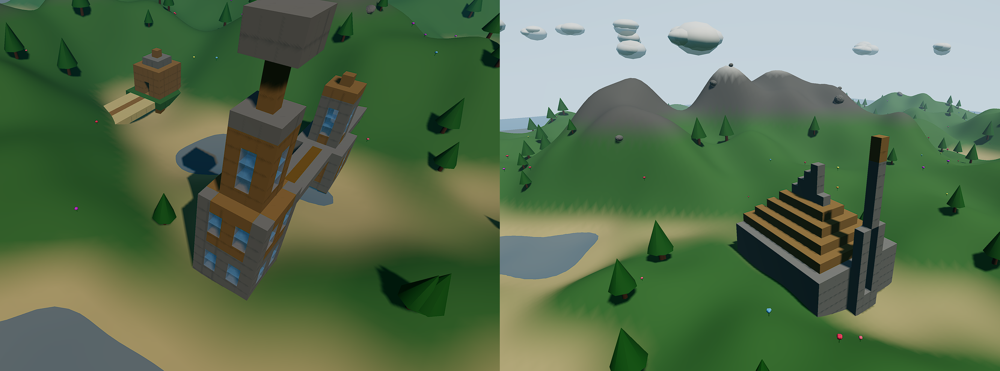

# 3D Landscape Generator

A browser-based 3D landscape generator with Minecraft-style block building. Built with Three.js — no build tools required.



## Background

I created this to test the new Opus 4.6 with Claude Code. The first step was to create a landscape/terrain generator, then add the first-person view, then Minecraft-style building, and finally AI creation of buildings.
Pretty amazing — this worked almost flawlessly with no errors in between. I also started a version with Codex and the new gpt-5.3-codex, also very nice, but I like the Claude version better. E.g. Codex also implemented a first-person view, but you cannot turn the camera (it always points to the middle).
The subscription usage was on the other hand much better: Codex just used a few percent, while with Opus 4.6 I reached the 5-hour limit pretty fast. I used a part of the bonus $50 currently given by Anthropic to get to the next 5-hour window, but it still took me another 5-hour session to get where this project is now.
And: if you try the AI building feature, be prepared to pay for it. The 'church' in the screenshot for example cost 10 cents in API usage.


## Features

- **Procedural terrain** — Simplex noise with fBm octaves, altitude-based vertex coloring (sand, grass, rock, snow), island-shaped falloff
- **Environment** — Water with animated waves, drifting clouds, sky dome, rocks, wildflowers, trees, fog
- **Time of day** — Slider controls sun position, sky colors, lighting, fog, and bloom in real time
- **First-person mode** — Walk around the landscape with WASD + mouse look
- **Block building** — Place and remove Minecraft-style blocks in first person (6 block types)
- **AI Structure Builder** — Describe a structure (e.g. "small house", "bridge") and Claude generates a block layout via the Anthropic API. Preview it as a ghost blueprint, rotate with Q/E, then click to place
- **Seed system** — Enter a numeric or text seed to revisit the same landscape
- **Screenshot** — Download the current view as PNG
- **Post-processing** — Bloom with dynamic intensity based on time of day

## Getting Started

Serve the files with any static HTTP server:

```bash
cd /workspace
python3 -m http.server 8000
```

Then open http://localhost:8000 in a browser.

## Controls

### Orbit View (default)
- **Left-drag** — Rotate camera
- **Right-drag** — Pan
- **Scroll** — Zoom

### First-Person Mode
| Input | Action |
|-------|--------|
| W/A/S/D | Move |
| Shift | Sprint |
| Mouse | Look around |
| Left click | Place block |
| Right click | Remove block |
| 1-6 / Scroll | Select block type |
| Esc | Release cursor |

### Blueprint Mode (after AI Build)
| Input | Action |
|-------|--------|
| Q / E | Rotate 90° |
| Left click | Place all blocks |
| Right click / Esc | Cancel |
| W/A/S/D | Move (repositions blueprint) |

### Block Types
1. Dirt
2. Grass
3. Stone
4. Wood
5. Sand
6. Glass (translucent)

## File Structure

```
index.html      — HTML shell, import map, UI overlay, CSS
js/app.js       — Scene, camera, controls, lighting, block system, render loop
js/terrain.js   — Procedural generation: terrain, water, trees, rocks, flowers, sky, clouds
```

## AI Structure Builder

1. Click **API Key** at the bottom of the sidebar and paste your Anthropic API key (stored in localStorage only)
2. Type a description in the **AI Build** field (e.g. "small house", "tower", "bridge")
3. Click **Build** — the app calls Claude Sonnet 4.5 to generate a block layout
4. You'll auto-enter first-person mode with a ghost blueprint preview
5. Walk to position it, press Q/E to rotate, left-click to place, right-click to cancel

## Dependencies

Loaded via CDN (jsDelivr), no install needed:

- [Three.js](https://threejs.org/) 0.170.0
- [simplex-noise](https://github.com/jwagner/simplex-noise.js) 4.0.3
- [Anthropic API](https://docs.anthropic.com/) — called directly from browser (requires API key)
